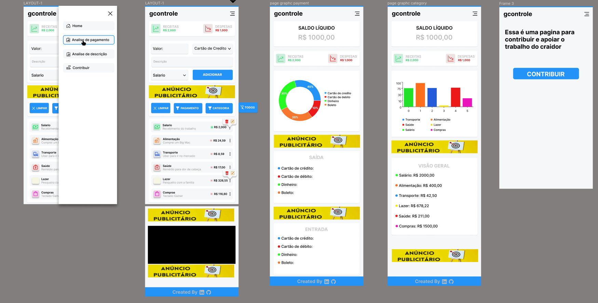

# gcontrole

## Objetivo 

O projeto 'gcontrole' é um site desenvolvido com foco no front-end, com o objetivo de oferecer um ambiente prático para organizar e visualizar seus gastos. Através de uma página dedicada à adição de despesas, divididas por categorias, e duas páginas com gráficos, você poderá obter uma perspectiva analítica detalhada e visualmente atraente dos seus gastos.

## Tecnologias e Ferramentas

  
<strong>💻 Front-end</strong>

  
 - HTML
 - CSS
 - [ReactJS](https://pt-br.reactjs.org/)
 - [React router](https://reactrouter.com/en/main)
 - [React google charts](https://www.react-google-charts.com/)

## Desing
[FIGMA](https://www.figma.com/file/ovOiHRTWHPXHNq9OB4sVeZ/gcontrole?type=design&node-id=0%3A1&mode=design&t=zlOAocFIw8ZLAKca-1)

## 
 Criado por [Vinicius Soares](https://www.linkedin.com/in/vinicius-soares21/)
    
